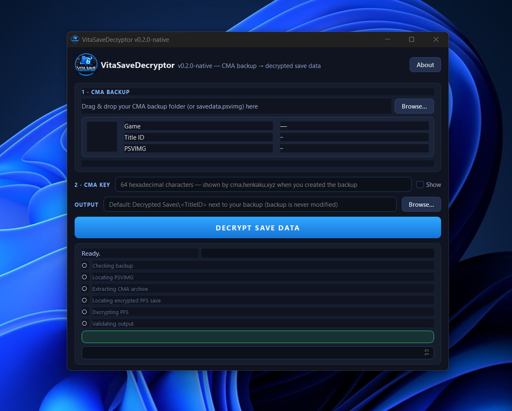
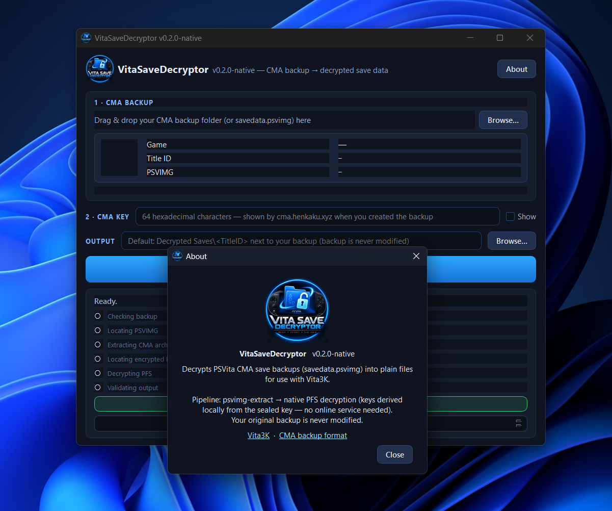

<p align="center">
  
</p>

<h1 align="center">Vita Save Decryptor (native)</h1>

<p align="center">
  <b>PS Vita CMA save backup decryption — fully offline, no online key service.</b><br/>
  A Windows GUI app that turns a CMA save backup (<code>savedata.psvimg</code>) into
  plain files ready for <a href="https://github.com/Vita3K/vita3k">Vita3K</a>.
</p>

---

## Screenshots

<p align="center">
  
</p>

<p align="center">
  
</p>

---

## Support & community

If this tool helps you, consider supporting the work:

| | |
|---|---|
| 📺 **YouTube** | [The New Game+](https://www.youtube.com/@TheNewGamePluss) — guides & walkthroughs |
| ☕ **Ko-fi** | [thenewgameplus](https://ko-fi.com/thenewgameplus) — buy me a coffee |
| 💬 **Discord** | [NGP "Bench" community](https://discord.gg/nwXq8wZzEA) — hang out & get help |

---

## What it does

Given a PS Vita CMA save backup, the app runs a two-stage pipeline:

1. **Stage 1 — unpack** the CMA archive (`savedata.psvimg`) into a working
   directory using a bundled copy of [psvimgtools](https://github.com/yifanlu/psvimgtools).
2. **Stage 2 — decrypt** every encrypted file in the PFS savedata set, byte-for-byte,
   using only key material derived locally from the set's own `sce_sys/sealedkey`.

The original tool shelled out to `psvpfsparser.exe` and fetched keys from the F00D
service (`cma.henkaku.xyz`). This native re-implementation does stage 2 **in process**
with a single Python dependency (pycryptodome) — so it works with no network access.

Your original backup is never modified; output goes to a separate folder you choose.

## What it decrypts

A PS Vita savedata PFS set:

```
<set>/
├── system.dat                  # XTS-AES encrypted
├── sce_sys/
│   ├── keystone                # XTS-AES encrypted
│   ├── param.sfo               # unencrypted (copied verbatim)
│   ├── safemem.dat             # XTS-AES encrypted
│   ├── sdslot.dat              # XTS-AES encrypted
│   └── sealedkey               # unencrypted — the key source
├── sce_pfs/
│   ├── files.db                # file table (SCENGPFS ver 3)
│   └── icv.db/<salt>.icv       # per-file ICV records (SCEICVDB)
```

Files whose `files.db` type has bit `0x4000` set are stored unencrypted and copied
verbatim; all others are XTS-AES-128 decrypted.

## How it works

All key material is derived locally — no F00D round-trip:

```
klicensee   = AES-128-CBC-decrypt(sealedkey[0:16], key=pfsSKKey__EncKey, iv=0)
base        = SHA1(klicensee)
dec_key     = SHA1(base ‖ SHA1([icv_salt, 1]_LE8))[0:16]
tweak_enc   = SHA1(base ‖ SHA1([icv_salt, 2]_LE8))[0:16]

Per 0x8000-byte sector (sector_base = 0 for standalone savedata files):
    seed     = AES-ECB(tweak_enc, u64_LE(0x8000 * sector_index))
    XTS-AES-128 decrypt with dec_key; IEEE P1619 tweak perturbation
    (multiply-by-2 in GF(2^128), reduction 0x87) continues across all
    sub-blocks of the sector.
```

Each file's `icv_salt` is resolved **deterministically** with the ICV Merkle oracle:
for every candidate salt, compute
`secret = SHA1(SHA1(klicensee) ‖ SHA1([0xA, icv_salt]_LE8))`, HMAC-SHA1 each
ciphertext sector, build the full binary Merkle tree (BFS heap layout), and pick the
salt whose root matches the 20-byte ICV stored in that file's `.icv` record. No
heuristics — exactly one salt matches per file.

## Building the Windows executable

From the project root, with a venv containing `requirements.txt`:

```bash
pyinstaller VitaSaveDecryptor.spec --noconfirm
```

Output: `dist/VitaSaveDecryptor.exe` — one self-contained windowed executable (the
Python runtime, PySide6 GUI, native stage-1 tool, and UI assets are all bundled).

## Running from source

```bash
pip install -r requirements.txt
python vita_main.py            # launches the GUI
```

Or use the decryptor directly:

```python
from pathlib import Path
from app.pfs_native import decrypt_pfs_set

out = decrypt_pfs_set(Path("path/to/extracted_savedata"), Path("output_dir"))
# out: list[Path] of every decrypted/copied file, mirroring the input layout
```

## Requirements

- Python 3.10+
- `PySide6` (GUI), `pycryptodome>=3.20` (stage-2 crypto) — see `requirements.txt`
- PyInstaller (build-time only) to produce the `.exe`

## Tests

Standalone regression test — no pytest, no network:

```bash
python tests/test_pfs_native.py
```

It decrypts the vendored PCSG90096 fixture and asserts every output file is
**byte-exact** against the reference `psvpfsparser.exe` ground truth (also vendored),
plus verbatim-copy, determinism, and structural checks. Exit code = number of failures.

## Project layout

```
app/
├── main.py                    # GUI + CLI entry logic
├── core.py                    # two-stage pipeline (stage 2 -> native)
├── pfs_native.py              # the pure-Python PFS decryptor
├── resources.py               # resource manager (frozen-aware paths)
└── resources/                 # logo.png, VitaSaveDecryptor.ico
tools/psvimgtools/             # bundled stage-1 tool + Cygwin DLLs (MIT)
tests/test_pfs_native.py       # regression test
tests/fixtures/hencore_savedata/   # PCSG90096 fixture (h-encore v2.0, MIT)
tests/fixtures/ground_truth/       # reference output for byte-exact checks
vita_main.py                   # PyInstaller entry shim
VitaSaveDecryptor.spec         # PyInstaller build spec
docs/DEVELOPMENT_STATUS.md     # development history & status
LICENSE                        # MIT (this project)
licenses/                      # third-party license texts
THIRD_PARTY_NOTICES.md         # provenance & redistribution notes
```

## Credits & acknowledgements

- **The New Game+** — author, GUI, and native re-implementation.
  [YouTube](https://www.youtube.com/@TheNewGamePluss) ·
  [Ko-fi](https://ko-fi.com/thenewgameplus) ·
  [Discord](https://discord.gg/nwXq8wZzEA)
- **Yifan Lu** — [psvimgtools](https://github.com/yifanlu/psvimgtools) (MIT): bundled
  stage-1 CMA unpacker.
- **The Qt Company Ltd.** & contributors — [PySide6](https://github.com/qtproject/pyside-pyside-setup)
  (LGPL v3 / Commercial): GUI toolkit.
- **Helder Eijs** — [pycryptodome](https://github.com/Legrandin/pycryptodome) (BSD-3):
  AES/SHA1 primitives.
- **TheFloW** — [h-encore](https://github.com/TheOfficialFloW/h-encore) (MIT): source of
  the public PCSG90096 regression fixture.
- **motoharu-gosuto** — [psvpfstools](https://github.com/motoharu-gosuto/psvpfstools):
  behavioral reference for the PFS / XTS-AES / ICV-Merkle algorithm (read-only; no code
  copied or redistributed).
- The broader PS Vita preservation community, including the
  [Vita3K](https://github.com/Vita3K/vita3k) project and its PFS tooling lineage.

See `THIRD_PARTY_NOTICES.md` for full provenance and license details.
